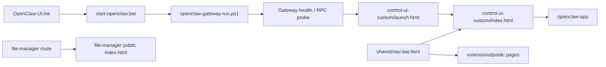

# OpenClaw UI 经验专栏：共享导航、入口分流与验证

## Summary
OpenClaw UI 经验专栏：共享导航、入口分流与验证

## Content
# OpenClaw UI 经验专栏：共享导航、入口分流与验证

## 设计原则

- 共享导航只保留一份真相：`/shared/nav-bar.html`。
- 入口要分流清楚：
  - 文件管理 -> `/file-manager`
  - 原生界面 -> `/control-ui-custom/launch.html`
  - 主 UI -> `/control-ui-custom/index.html`
- 先看真实 DOM，再看源码；以 `customElements.get('openclaw-app')` 和页面实际状态为准。
- 静态资源一旦改动，立刻做 cache busting，避免浏览器继续吃旧导航。
- 启动链路必须保留双重 bootstrap：`launch.html` 预热 token，`index.html` 二次兜底。

## 架构图

- `launch.html` 负责把 `token` 和 `gatewayUrl` 写入浏览器存储，再跳转到主 UI。
- `index.html` 会在 bundle 加载前再次执行 bootstrap，避免路由切换把登录态带丢。
- `nav-bar-behavior.js` 会把页面里的本地导航替换成共享导航源，保证入口一致。
- `file-manager` 不是原生壳，它有独立页面和独立 API，点击后应该进入文件管理页本身。
- `extensions/public` 与 `control-ui-custom` 共用同一份导航语义，减少页面分叉。

## 验证清单

1. `Test-NetConnection 127.0.0.1 -Port 5000` 必须成功。
2. `Invoke-WebRequest http://127.0.0.1:5000/control-ui-custom/index.html` 必须返回 200。
3. `Invoke-WebRequest http://127.0.0.1:5000/file-manager` 必须返回 200。
4. 浏览器里 `customElements.get('openclaw-app')` 必须为 `true`。
5. 点击“原生界面”必须进入 `/control-ui-custom/launch.html`，不能回到根路径 `/`。
6. 点击“文件管理”必须进入 `/file-manager`，不能误跳到原生壳。
7. 导航栏如果出现乱码，先查页面实际 served 路径，再查缓存版本号，不要先怀疑源码丢失。
8. 共享导航、主 bundle、页面本地副本三处要同步验证，避免“改了一处，另一处还在旧版本”。

## Sections
-